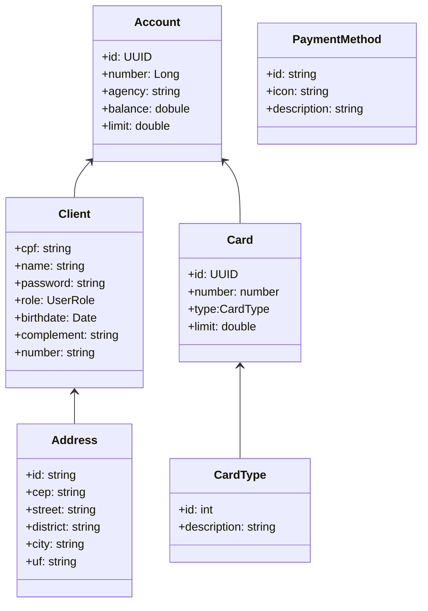

<h1 align="center">
        
</h1>

# 📝 API Bancária - Bootcamp Santander 2023

<p align="center"> Projeto final de API utilizando SpringBoot.</p>

# 🛠 Tecnologias Utilizadas

- SpringBoot
- OpenFeign
- JUnit e Mockito para Testes
- Swagger para documentação
- Spring Security
- Lombok

# 🎯 Objetivo Principal

O objetivo principal era colocar em prática todo o conhecimento adquirido durante o curso, criando uma API Bancária seguindo as melhores condutas dos padrões de projeto. Além de ser uma API segura, com consultas externas e testes para garantir a escalabilidade do projeto.


# 🎨 Diagrama do Projeto



## 💻 Como Rodar?

1. Clone o repositório

```bash
git clone https://github.com/Arawns1/projeto-final-santander-dev-week-2023.git
```

2. Abra o projeto em sua IDE favorita e execute o programa

3. A documentação pode ser encontrada em:

```
http://localhost:8080/swagger-ui/index.html#/
```

Por padrão, a aplicação é iniciada em `http://localhost:8080/`


